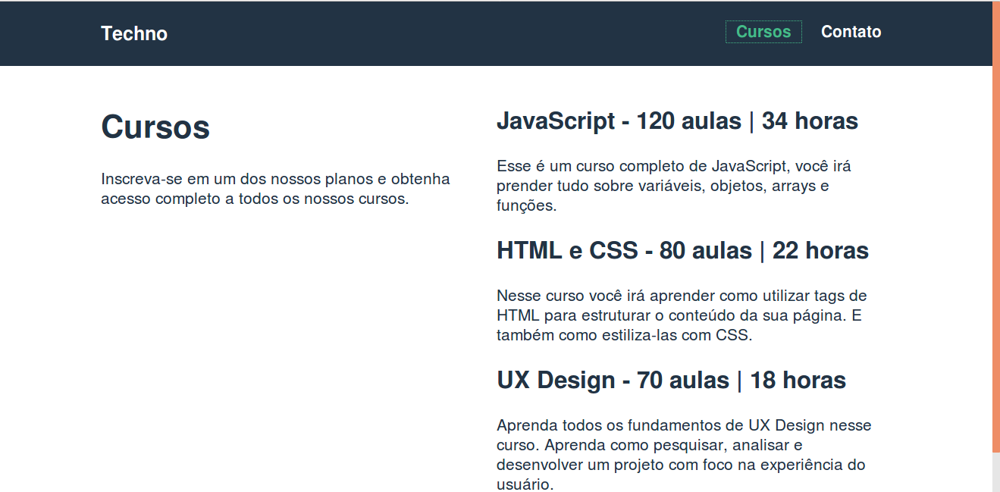
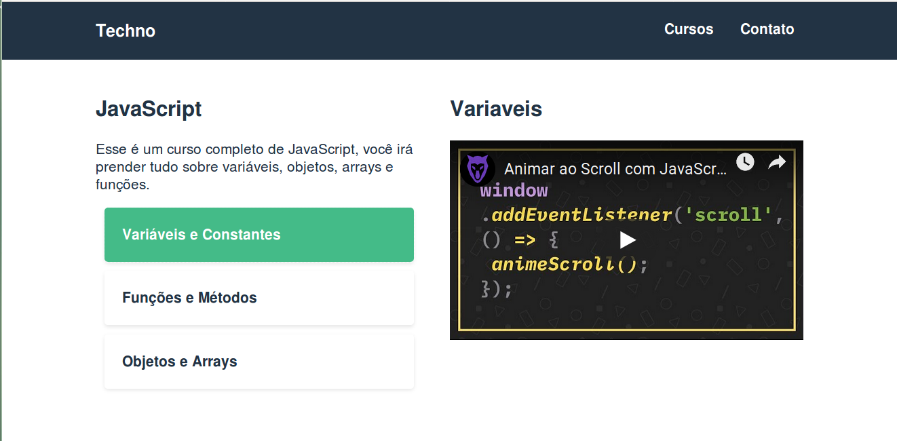
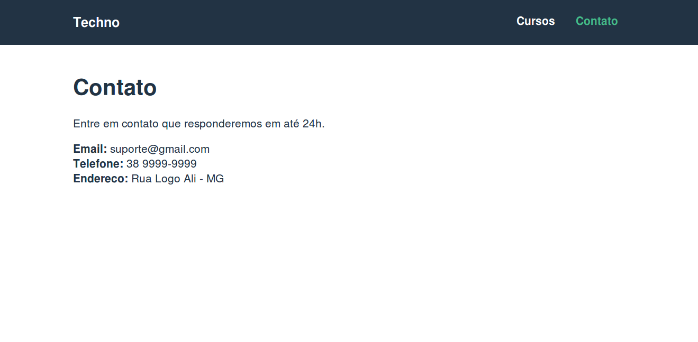

# Techno-cursos

## Project setup
```
npm install
```

### Compiles and hot-reloads for development
```
npm run serve
```

### Compiles and minifies for production
```
npm run build
```

### Run your tests
```
npm run test
```

### Lints and fixes files
```
npm run lint
```

## Screenshots
### Página Inicial da Techno Cursos


### Cursos disponíveis


### Página do Curso


### Página de Contatos


Os dados são disponibilizados pela fake api json: https://github.com/typicode/json-server que consome os dados do arquivo api.json disponibilizado no projeto.

### Inicialização da API
```
json-server --watch api.json
```

Curso de Vuejs da www.origamid.com
